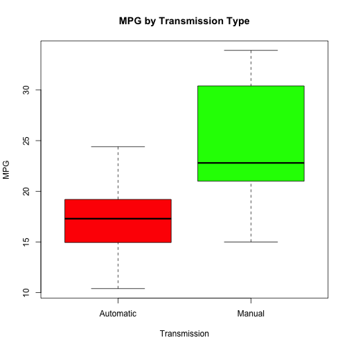
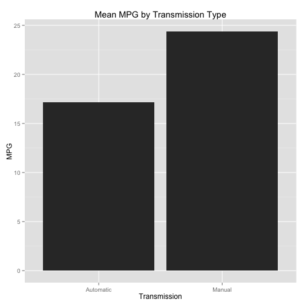
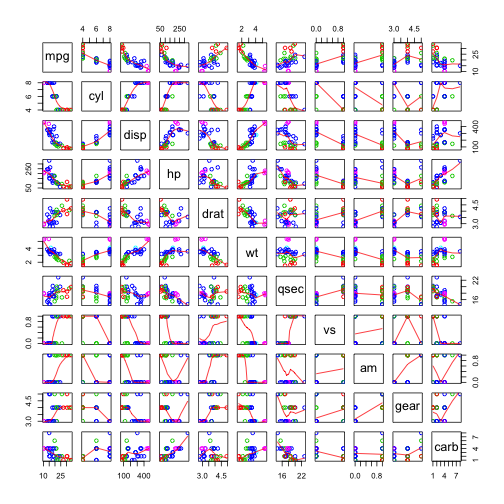
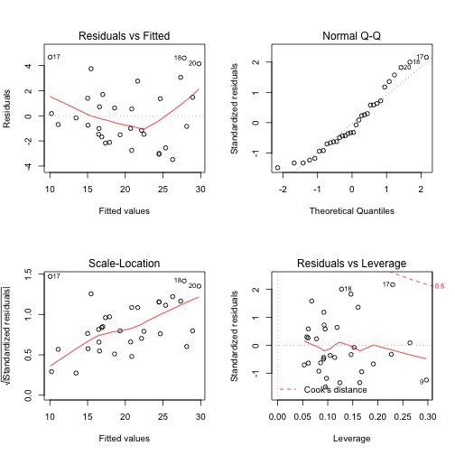

# Is Manual or Automatic Transmission Better For MPG in Cars?

## Executive Summary
In this report, we will look at some data that was collected by *Motor Trends* Magazine on certain cars. In our analysis we will be exploring the relationship between certain variables and miles per gallon for each car. In particular we will focus on the effect that transmission type has on miles per gallon. In order to do this analysis, we will build several regression models. We will then compare these regression models and decide which model is best. Once we have decided which model is best, we will then interpret the data and explore our findings in the **Conclusion** section of this report. All data supporting the conclusion can be found in the **Appendix** section of this report.

## Conclusion
This section of the report gives an interpretation of the data found in the **Appendix** section. It also details how we came up with the model that we will be interpretting. 
 
First we built a regression model using the code `fit_full <- lm(mpg~ ., mtcars)`. This code builds a regression model using `mpg` as the dependent variable and all of the other data in the model as independent variables. Next, we looked at a regression model built using the code `fit_transmission <- lm(mpg~transmission, mtcars)`. This regression model uses mpg as the dependent variable and transmission as the independent variable. However, neither of these two models is the best model for our purposes. 
 
Whenever variables are not included that should be included, the model is said to be underfitted. Underfitting causes the variance in the model to have a greater bias. The bias means that more weight will be placed on certain variables than should be. However, whenever variables are included that should not be, the model is said to be overfitted. Overfitting the model will produce less reliable estimates. 
 
In order to find the best fit, we use the code `bestfit <-  step(fit_full, direction = "both")`. This code tells R to go through the `full_fit` model and use the different variables in different combinations, until the best fit is found. This code produces a regression model using the following code `bestfit <- lm(mpg~weight + quarter_mile_time + transmission)`. 
 
Once we built these three models, we use them to build nested models. In each of these nested models, we add variables. So we first start with the `fit_transmission` model, followed by the `bestfit` model, and then the `fit_full` model. We then run the code `anova(fit_transmission, bestfit, fit_full)`, which does the nesting and gives us the analysis of variance.
 
Our initial exploratory analysis shows that manual transmissions tend to have a range of mpg's that are higher than the range of automatic transmissions. We also see that the data does not have any outliers for either transmission type. This fact is made apparent by the graph **MPG By Transmission Type** located in the **Appendix** section. This graph also shows that the median MPG is higher for manual transmissions than for automatic transmissions. The next graph shows the **Mean MPG by Transmission Type**. In this graph, we see that the mean MPG from our data is higher for manual transmissions than for automatic transmissions. These initial observations would lead us to conclude that manual transmissions are better for MPG than automatic transmissions. However, further analysis is available through the regression models.
  
The initial model labeled `fit_transmission` shows that mean MPG for automatic transmission is about 17.147 MPG. When the transmission is manual the mean MPG is about 7.245 MPG more for a total mean of 24.39 MPG. The model also shows that at the 0.001 confidence interval, these variables are significant. The p-value is 0.000285. This number means that we can reject the null hypothesis. Therefore, the variable transmission is significant. However, this model also shows that there is an adjusted R-Squared value of .3385. This means that 33.85% of the variance is explained by this model. This number is low, but fortunately we have a better model with a better fit. 

The model with the best results is the model that is labeled `bestfit` in the **Appendix** section. In this model, we see that the mean MPG for automatic transmission is about 9.62 MPG. When the transmission is manuanl the mean MPG is about 2.94 MPG more for a total mean of 12.57 MPG. Therefore, any change to the variable transmission, should cause the MPG to increase by the aforementioned values. The models also shows that at 0.001, the variables `weight` and `quarter_mile_time` are significant. At 0.05, the variable `transmission` is significant. The p-value is 1.21e-11. This number means that we can reject the null hypothesis. Therefore, the variable transmission is significant.We also see that the adjusted R-Squared value is 0.8336. Therefore 83.36% of the variance is explained by this model.
 
When comparing models using the **Analysis of Variance** table, we find that the second model is significant at the 0.001 level. This means that the additional variables in the second model are necessary. However some of the variables in the third are not necessary. We also see that when we run a t-test on MPG and Transmission, that the p-value is 0.001374. In this case. This means that we can reject the null hypothesis, meaning that Manual and Automatic transmissions in this data are from different populations. We also see in the **Residual Diagnostic** section that the data is independent. This is shown in the `Residual vs. Fitted` plot. The `Normal Q-Q` plot shows that the data is approximately normally distributed. The `Scale Location` plot indicates constant variance. And the `Residuals vs. Leverage` plot shows that there are some leverage points.

In conclusion, we see that when holding all other variables constant, a manual transmission will produce a higher MPG than an automatic transmission. Our `bestfit` model also indicates an increase in weight will cause a decrease in MPG when all other variables are held constant. Although this model is helpful, there are shortcomings. We find that the automatic and manual transmission data comes from different populations. So although there appears to be a higher MPG for manual than automatic transmissions, we would have to see the difference in an automatic transmission and a manual transmission in the same model car for a better idea of the transmission's impact on MPG.

## Appendix


#### Cars Data


```
##                    mpg cyl disp  hp drat    wt  qsec vs am gear carb
## Mazda RX4         21.0   6  160 110 3.90 2.620 16.46  0  1    4    4
## Mazda RX4 Wag     21.0   6  160 110 3.90 2.875 17.02  0  1    4    4
## Datsun 710        22.8   4  108  93 3.85 2.320 18.61  1  1    4    1
## Hornet 4 Drive    21.4   6  258 110 3.08 3.215 19.44  1  0    3    1
## Hornet Sportabout 18.7   8  360 175 3.15 3.440 17.02  0  0    3    2
## Valiant           18.1   6  225 105 2.76 3.460 20.22  1  0    3    1
```


### Exploratory Analysis
   

#### Regression Models

##### Regression Model - All Variables

```
##                Estimate  Std. Error    t value   Pr(>|t|)
## (Intercept) 12.30337416 18.71788443  0.6573058 0.51812440
## cyl         -0.11144048  1.04502336 -0.1066392 0.91608738
## disp         0.01333524  0.01785750  0.7467585 0.46348865
## hp          -0.02148212  0.02176858 -0.9868407 0.33495531
## drat         0.78711097  1.63537307  0.4813036 0.63527790
## wt          -3.71530393  1.89441430 -1.9611887 0.06325215
## qsec         0.82104075  0.73084480  1.1234133 0.27394127
## vs           0.31776281  2.10450861  0.1509915 0.88142347
## am           2.52022689  2.05665055  1.2254035 0.23398971
## gear         0.65541302  1.49325996  0.4389142 0.66520643
## carb        -0.19941925  0.82875250 -0.2406258 0.81217871
```

##### Regression Model - Transmission Type Only

```
##                     Estimate Std. Error   t value     Pr(>|t|)
## (Intercept)        17.147368   1.124603 15.247492 1.133983e-15
## transmissionManual  7.244939   1.764422  4.106127 2.850207e-04
```

```
## 
## 	Welch Two Sample t-test
## 
## data:  mpg by transmission
## t = -3.7671, df = 18.332, p-value = 0.001374
## alternative hypothesis: true difference in means is not equal to 0
## 95 percent confidence interval:
##  -11.280194  -3.209684
## sample estimates:
## mean in group Automatic    mean in group Manual 
##                17.14737                24.39231
```

##### Regression Model - Best Fit


```
##                     Estimate Std. Error   t value     Pr(>|t|)
## (Intercept)         9.617781  6.9595930  1.381946 1.779152e-01
## weight             -3.916504  0.7112016 -5.506882 6.952711e-06
## quarter_mile_time   1.225886  0.2886696  4.246676 2.161737e-04
## transmissionManual  2.935837  1.4109045  2.080819 4.671551e-02
```

 

##### Comparing Models

```
## Analysis of Variance Table
## 
## Model 1: mpg ~ transmission
## Model 2: mpg ~ weight + quarter_mile_time + transmission
## Model 3: mpg ~ cyl + disp + hp + drat + wt + qsec + vs + am + gear + carb
##   Res.Df    RSS Df Sum of Sq       F    Pr(>F)    
## 1     30 720.90                                   
## 2     28 169.29  2    551.61 39.2687 8.025e-08 ***
## 3     21 147.49  7     21.79  0.4432    0.8636    
## ---
## Signif. codes:  0 '***' 0.001 '**' 0.01 '*' 0.05 '.' 0.1 ' ' 1
```

